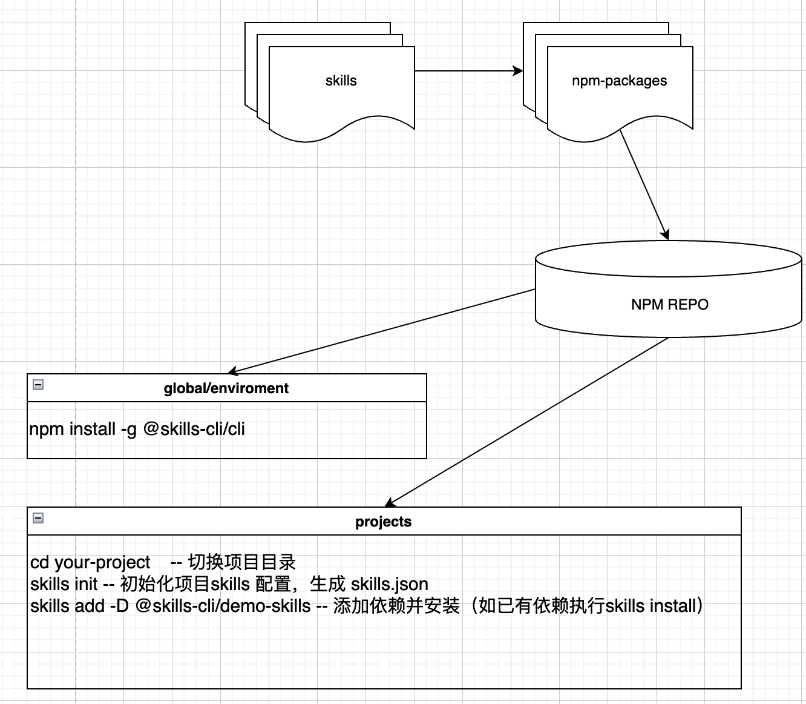

# @skills-cli/cli

[](https://badge.fury.io/js/@skills-cli%2Fcli)

Skills CLI 是一个基于 npm 生态的可扩展技能包管理器，核心策略：**调用 npm 完成基础操作，自身只处理 skills.json 和扩展功能**。

## 整体架构



流程说明：
1.  开发者定义 `skills` → 打包成 `npm-packages` → 发布到 `NPM REPO`
2.  用户通过 `npm install -g @skills-cli/cli` 全局安装 CLI 工具
3.  在项目中使用 `skills init` 初始化，`skills add` 添加依赖，`skills install` 安装技能

## 📦 安装

```bash
npm install -g @skills-cli/cli
```

---

## 📖 使用者指南 - 项目初始化与配置拉取

### 1. 初始化项目

在你的项目根目录执行：

```bash
skills init
```

这会在项目根目录生成一个 `skills.json` 配置文件：

```json
{
  "name": "your-project",
  "version": "1.0.0",
  "description": "",
  "installDirectory": "skills_modules",
  "dependencies": {},
  "devDependencies": {},
  "config": {}
}
```

### 2. 添加 Skill 依赖

添加你需要的 Skill 包到项目：

```bash
# 添加 Skill 到 dependencies
skills add @skills-cli/vue2-springboot-mybatis

# 添加到 devDependencies
skills add -D @skills-cli/demo-skills
```

### 3. 安装所有依赖

添加完依赖后，执行安装：

```bash
skills install
# 或使用别名
skills i
```

这个命令会：
1. 读取 `skills.json` 中的所有依赖
2. 调用 `npm install` 安装所有 npm 包
3. 自动注册所有 Skill 的优先级配置到全局

### 配置安装目录

Skills 默认安装到项目根目录下的 `skills_modules` 目录，与 `node_modules` 分离。如果你想要修改安装目录，可以在 `skills.json` 中配置：

```json
{
  "name": "my-project",
  "version": "1.0.0",
  "installDirectory": "skills_modules",
  "dependencies": {}
}
```

如果需要回退到使用 `node_modules`，修改为：

```json
{
  "installDirectory": "node_modules"
}
```

### 4. 日常使用命令

```bash
# 查看已安装的所有 Skills
skills list
# 或别名
skills ls

# 搜索 Skills
skills search vue2
# 或别名
skills s vue2

# 查看某个 Skill 详情
skills info @skills-cli/vue2-springboot-mybatis

# 移除不需要的 Skill
skills remove @skills-cli/demo-skills
# 或别名
skills rm @skills-cli/demo-skills

# 更新所有 Skill 依赖
skills update
# 或别名
skills up

# 登录 npm（发布时需要）
skills login
```

---

## 🎯 辅助编程 - 使用已拉取的 Skills

### 引入已安装的 Skill

Skill 安装后就是一个普通的 npm 包，可以直接在你的代码中引入使用：

```javascript
// 在你的代码生成工具中引入 Skill
const vueSkill = require('@skills-cli/vue2-springboot-mybatis');

// 调用 Skill 提供的能力
const code = vueSkill.generateVueCrudPage({
  className: 'User',
  tableName: 'user',
  columns: [
    { name: 'id', type: 'Long', label: 'ID', primaryKey: true },
    { name: 'username', type: 'String', label: '用户名' },
    { name: 'email', type: 'String', label: '邮箱' }
  ]
});

// 生成的代码可以直接写入文件
fs.writeFileSync('UserPage.vue', code);
```


### 完整示例：代码生成器

以下是一个完整的前端代码生成器示例（来自 [skills-cli-use-demo](https://github.com/finchguo/skills-cli/blob/main/skills-cli-use-demo)）：

```javascript
// 用户填写实体信息
const entityInfo = {
  className: 'User',
  tableName: 'user',
  columns: [
    { name: 'id', type: 'Long', label: 'ID', primaryKey: true },
    { name: 'username', type: 'String', label: '用户名' }
  ]
};

// 根据选择的能力分别生成代码
const result = [];

if (selectedCapabilities.includes('generate-vue2-crud-page')) {
  const code = require('@skills-cli/vue2-springboot-mybatis')
    .generateVueCrud(entityInfo.className, entityInfo.tableName, entityInfo.columns);
  result.push({ filename: 'UserPage.vue', code });
}

if (selectedCapabilities.includes('generate-springboot-controller')) {
  const code = require('@skills-cli/vue2-springboot-mybatis')
  .generateSpringController(entityInfo.className, entityInfo.columns);
  result.push({ filename: 'UserController.java', code });
}

if (selectedCapabilities.includes('generate-mybatis-entity')) {
  const code = require('@skills-cli/vue2-springboot-mybatis')
  .generateMyBatisEntity(entityInfo.className, entityInfo.columns);
  result.push({ filename: 'User.java', code });
}

// 输出生成结果
console.log(result);
```

---

## 👨‍💻 开发者指南 - 创建与发布 Skill 版本

### 1. 创建新 Skill

```bash
# 创建目录并进入
mkdir my-skill && cd my-skill

# npm 初始化，使用你的 scope
npm init -y --scope=skills-cli

# skills 初始化
skills init
```

### 2. 配置 skills.json

编辑项目根目录的 `skills.json`：

```json
{
  "name": "my-skill",
  "version": "1.0.0",
  "description": "我的自定义 Skill",
  "tags": ["vue", "frontend", "code-generation"],
  "capabilities": ["generate-vue-component", "generate-vue-crud"]
}
```

**字段说明：**

| 字段 | 类型 | 必填 | 说明 |
|------|------|------|------|
| `name` | string | ✅ | Skill 名称 |
| `version` | string | ✅ | 版本号 |
| `description` | string | - | Skill 描述 |
| `tags` | string[] | - | 标签，用于搜索 |
| `capabilities` | string[] | - | 能力列表，声明这个 Skill 能做什么 |

### 3. 编写 Skill 代码

在 `index.js` 中实现你的能力：

```javascript
// index.js
function generateVueComponent(options) {
  // 你的代码生成逻辑
  return `
<template>
  <div class="${options.className}">
    <!-- ... -->
  </div>
</template>

<script>
export default {
  name: '${options.className}'
}
</script>
  `.trim();
}

function generateVueCrud(options) {
  // 你的 CRUD 生成逻辑
  return '...';
}

// 导出所有能力
module.exports = {
  generateVueComponent,
  generateVueCrud
};
```

> 注意：Skills 是普通 npm 包，你可以使用任何 npm 依赖来辅助你的代码生成。

### 4. 验证与发布

```bash
# 发布前验证 skills.json 格式
skills publish --dry-run

# 正式发布
skills publish

# 发布到 beta 标签
skills publish --tag beta
```

`skills publish` 会先验证你的 `skills.json` 格式是否正确，验证通过后调用 `npm publish`。

### 5. 版本维护与更新

**发布新版本：**

1. 修改 `package.json` 和 `skills.json` 中的版本号
2. 再次执行 `skills publish` 即可

**取消发布：**

```bash
npm unpublish @skills-cli/my-skill@1.0.0
```

### 6. 已发布 Skill 示例

| Skill | Description |
|-------|------|
| [@skills-cli/demo-skills](https://www.npmjs.com/package/@skills-cli/demo-skills) | Demo Skill 示例 |
| [@skills-cli/vue2-springboot-mybatis](https://www.npmjs.com/package/@skills-cli/vue2-springboot-mybatis) | Vue2 + SpringBoot + MyBatis 全栈代码生成 |

---

## 命令速查

| 命令 | 别名 | 说明 |
|------|------|------|
| `skills init` | - | 初始化 `skills.json` |
| `skills install` | `i` | 安装所有依赖 |
| `skills add <packages>` | `a` | 添加 Skills 依赖 |
| `skills remove <packages>` | `rm` | 移除 Skills 依赖 |
| `skills update` | `up` | 更新 Skills 依赖 |
| `skills publish` | - | 发布 Skill 包 |
| `skills search <keyword>` | `s` | 搜索 Skills |
| `skills info <package>` | - | 查看 Skill 详情 |
| `skills login` | - | 登录 npm |
| `skills list` | `ls` | 列出已安装 |

**Options:**
- `skills add -D <pkg>` - 保存到 devDependencies
- `skills publish --tag beta` - 发布到 beta 标签

---

## 许可证

MIT © [finchguo](https://github.com/finchguo)

---

**skills-cli** - 让技能分发变得简单 🎉
